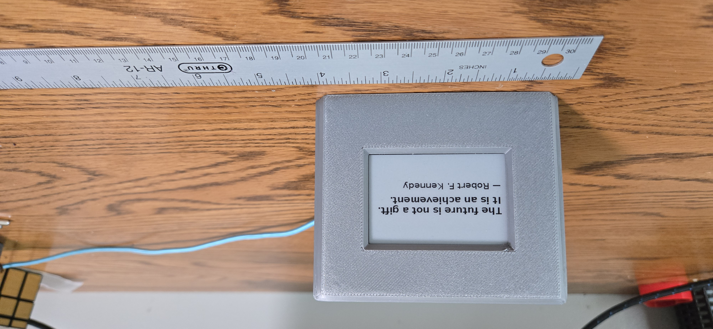
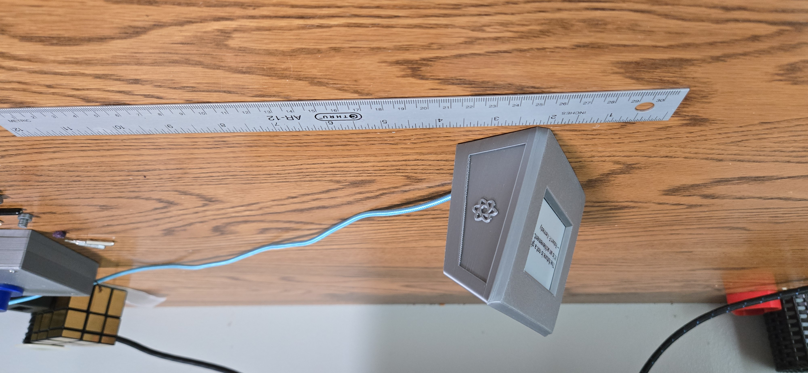
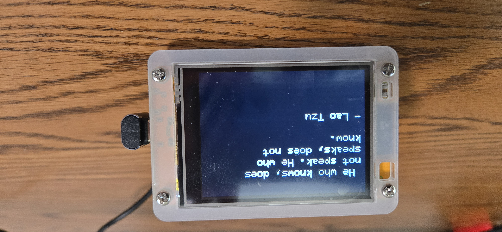
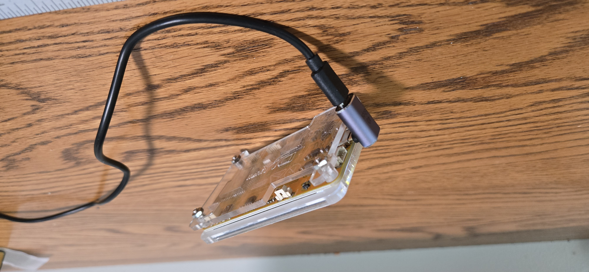
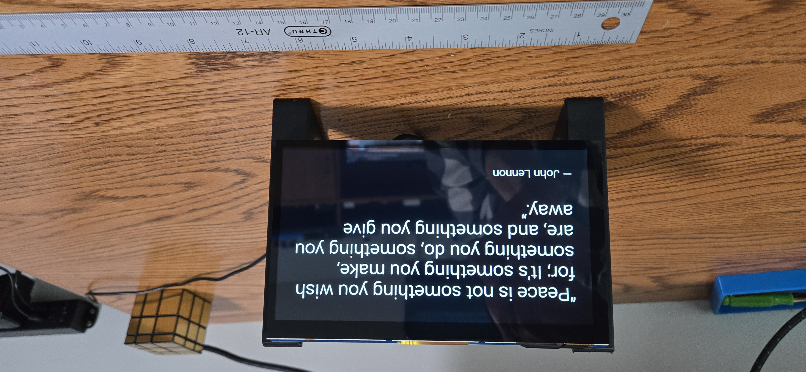
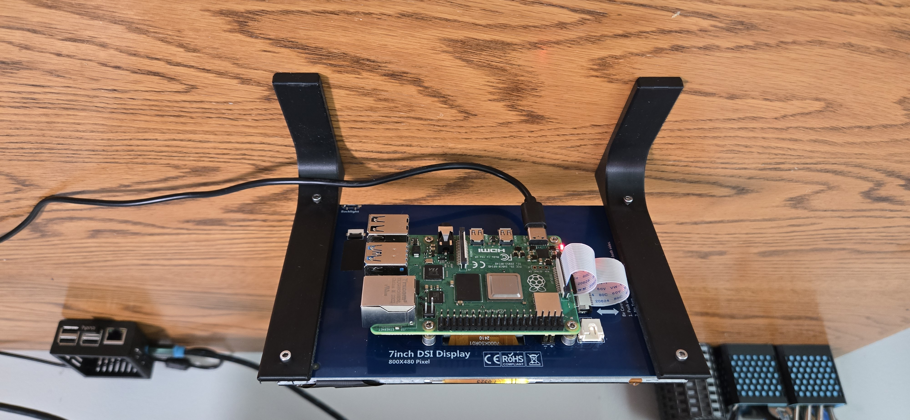
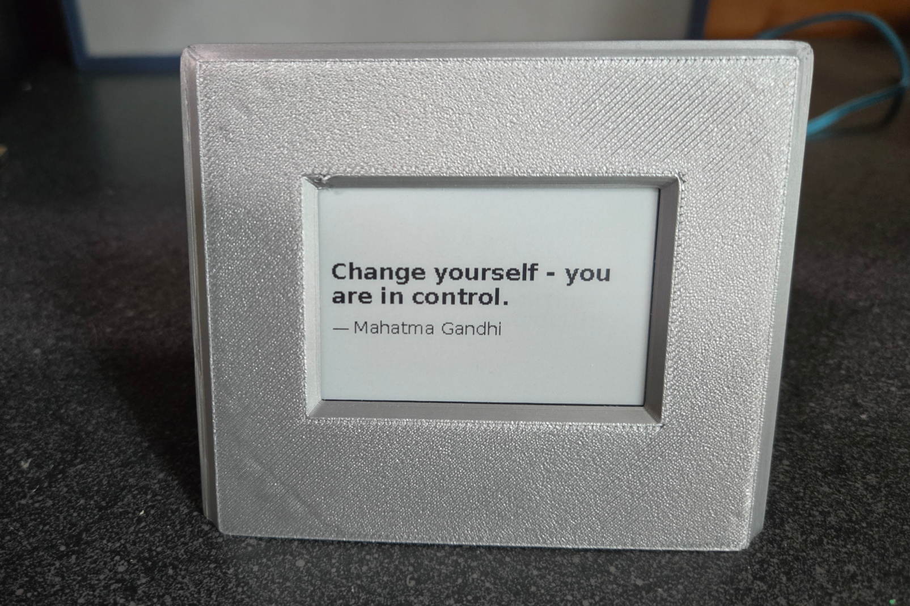

# Wise-Pi

A minimalist Raspberry Pi project that displays rotating quotes on a small display. Perfect for your desk, nightstand, bookshelf, or as a gift. There are three different variants of the project:

---

## Wise-Pi ePaper Display

<p float="left">
  
  
</p>

---

## Wise-Pi CYD Version (Cheap Yellow Display)

<p float="left">
  
  
</p>

---

## Wise-Pi DASH Version (7″ DSI Display)

<p float="left">
  
  
</p>

---
> **Branches at a glance**

|      Branch      | Target hardware                                    | What it contains                                                                 | Where to look |
|-------------------|------------------------------------------------|-----------------------------------------------------------------------|---------------|
| **main**                       | Raspberry Pi Zero 2 W + Waveshare 2.7" e-paper     | Original Python app (`quote_display.py`) and systemd service; e-paper enclosure | root, `stl_files/`, `images/` |
| **cyd-esp32-2_8**               | ESP32 Dev + 2.8" CYD (ILI9341) TFT                 | Arduino/PlatformIO sketch using **TFT_eSPI**, auto-brightness via LDR, secrets  | `cyd/`, `cyd/include/secrets.example.h` |
| **pi-dash-7in**                | Raspberry Pi 4 + 7" DSI (or HDMI) display (no touch) | FastAPI backend + static HTML/JS frontend; Chromium kiosk + systemd units        | `dash/app`, `dash/systemd` |


The default branch focuses on the Pi Zero + 2.7" e-paper build and desk-friendly case STLs. 

**Switching between branches**
```bash
git fetch --all --prune
git switch main            # e-paper build
git switch cyd-esp32-2_8   # ESP32 CYD build
git switch pi-dash-7in     # 7" dashboard build


## 📷 Wise-Pi Overview

Wise-Pi is a self-contained quote display that fetches and displays inspirational quotes from the internet 
using Wi-Fi. The frequency of new quote retrieval is configurable. No keyboard, mouse, or screen is needed — just 
power it on and enjoy. The screen is a crisp, power-efficient e-paper display, so it stays readable even during power
interruptions.

---

## 🛠️ Hardware Requirements

- Raspberry Pi Zero 2 W
- Waveshare 2.7" e-Paper HAT (264x176)
- microSD card (8GB or larger)
- USB power supply (e.g. phone charger)

Optional:

- 3D printed enclosure (STL files provided)


## 🔌 Software Setup

### 1. Flash Raspberry Pi OS (Lite or Desktop)

Use Raspberry Pi Imager to flash the SD card. Enable SSH and set up Wi-Fi if desired.

### 2. SSH In and Update

```bash
sudo apt update && sudo apt upgrade -y

mkdir wise-pi
cd wise-pi
```

### 3. Clone this repository

```bash
git clone https://github.com/stvenmobile/wise-pi.git
```

### 4. Set up Python environment

```bash
cd wise-pi
sudo apt install python3-pip python3-venv -y
python3 -m venv venv
source venv/bin/activate
pip install -r requirements.txt
```

### 5. Run the Quote Display

```bash
python quote_display.py
```

### 6. Enable on boot (run as a service)

Edit the wise-pi.service file to contain valid paths for your environment.
Then...

```bash
sudo cp wise-pi.service /etc/systemd/system/wise-pi.service
sudo systemctl daemon-reload
sudo systemctl enable wise-pi.service
sudo systemctl restart wise-pi.service

```

Verify the service is running:

```bash
sudo systemctl status wise-pi.service
```

---

## 🖼️ Case Design

- The included STLs provide a desk-friendly enclosure at a 20° angle
- Designed for flush display mounting with visible screen window
- Back panel is designed to snap-fit or screw into place (may need some sanding)
- I used hot glue to secure the display to the mounting posts.

Files:

- `case.stl` - Main case
- `back.stl` - Back Panel
- `epaper case v2.3mf` - 3mf version

---




<p float="left">
  
  
</p>


---

## 📦 File List

- `quote_display.py` – main script
- `requirements.txt` – Python dependencies
- `wise-pi.service` - service definition file
- `stl_files/` – printable case parts
- `images/` – build photos

---

## 🌐 Credits & Attribution

- Quotes pulled from the [ZenQuotes API](https://zenquotes.io/)
- e-Paper driver provided by [Waveshare's Python libraries](https://github.com/waveshare/e-Paper)

---

## 🧪 License

MIT License — free to use, share, remix, and improve.

---

## 💡 Inspired by

The quiet joy of slow technology.

If you build one or remix it, please share a photo — I'd love to see it.


