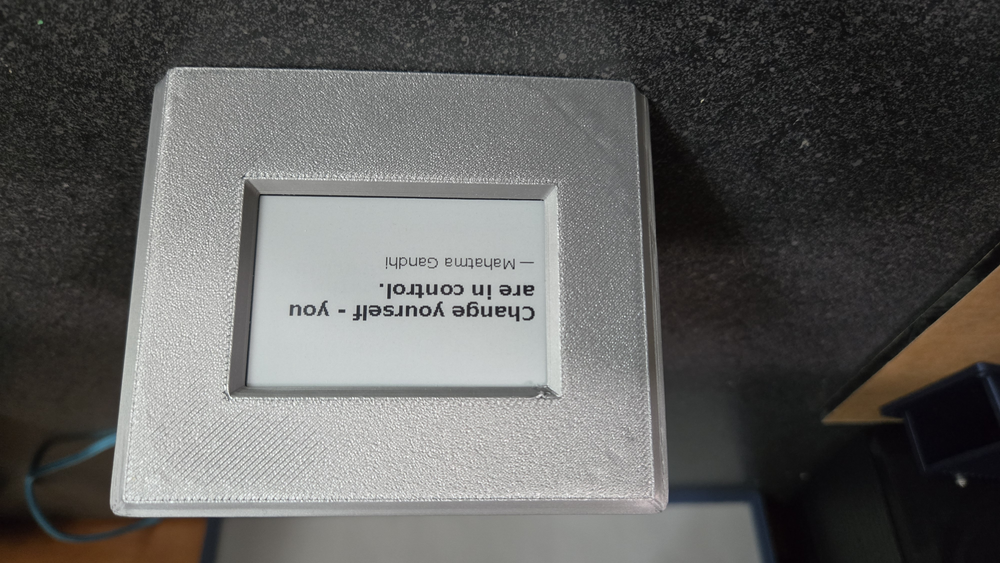
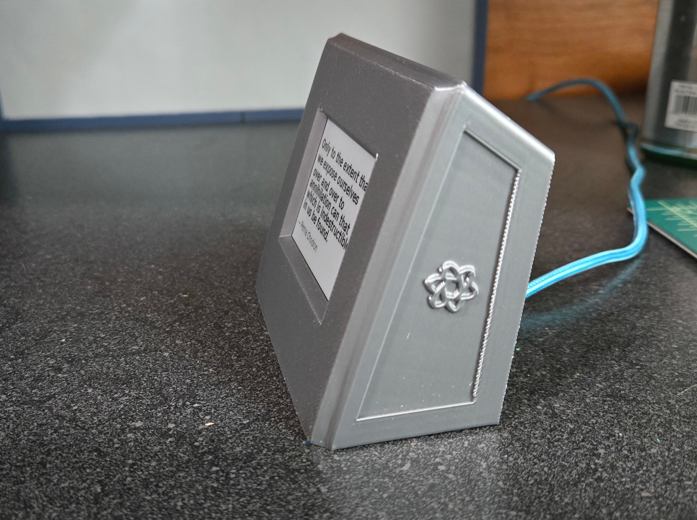

# Wise-Pi

A minimalist Raspberry Pi Zero project that displays rotating quotes on a Waveshare 2.7" e-paper display.
Perfect for your desk, nightstand, bookshelf, or as a gift.






---

## 📷 Overview

Wise-Pi is a self-contained quote display that fetches and displays inspirational quotes from the internet 
every 30 minutes. The screen is a crisp, power-efficient e-paper display, so it stays readable even with power
interruptions.

---

## 🛠️ Hardware Requirements

- Raspberry Pi Zero 2 W
- Waveshare 2.7" e-Paper HAT (264x176)
- microSD card (8GB or larger)
- USB power supply (e.g. phone charger)

Optional:

- 3D printed enclosure (STL files provided)
--

## 🔌 Software Setup

### 1. Flash Raspberry Pi OS (Lite or Desktop)

Use Raspberry Pi Imager to flash the SD card. Enable SSH and set up Wi-Fi if desired.

### 2. SSH In and Update

```bash
sudo apt update && sudo apt upgrade -y

mkdir wise-pi
cd wise-pi
```

### 3. Clone this repository

```bash
git clone https://github.com/stvenmobile/wise-pi.git
```

### 4. Set up Python environment

```bash
cd wise-pi
sudo apt install python3-pip python3-venv -y
python3 -m venv venv
source venv/bin/activate
pip install -r requirements.txt
```

### 5. Run the Quote Display

```bash
python quote_display.py
```

### (Optional) Enable on boot (run asd a service)

Edit the wise-pi.service file to contain valid paths for your environment.
Then...

```bash
sudo cp wise-pi.service /etc/systemd/system/wise-pi.service
sudo systemctl daemon-reload
sudo systemctl enable wise-pi.service
sudo systemctl restart wise-pi.service

```

Verify the service is running:

```bash
sudo systemctl status wise-pi.service
```

---

## 🖼️ Case Design

- The included STLs provide a desk-friendly enclosure at a 20° angle
- Designed for flush display mounting with visible screen window
- Back panel is designed to snap-fit or screw into place (coming soon)
- I used hot glue to securee the display to the mounting posts.

Files:

- `case.stl` - Main case
- `back.stl` - Back Panel
- `epaper case v2.3mf` - 3mf version

---


---

## 📦 File List

- `quote_display.py` – main script
- `requirements.txt` – Python dependencies
- `wise-pi.service` - service definition file
- `stl_files/` – printable case parts
- `images/` – build photos

---

## 🌐 Credits & Attribution

- Quotes pulled from the [ZenQuotes API](https://zenquotes.io/)
- e-Paper driver provided by [Waveshare's Python libraries](https://github.com/waveshare/e-Paper)

---

## 🧪 License

MIT License — free to use, share, remix, and improve.

---

## 💡 Inspired by

The quiet joy of slow technology.

If you build one or remix it, please share a photo — I'd love to see it.


