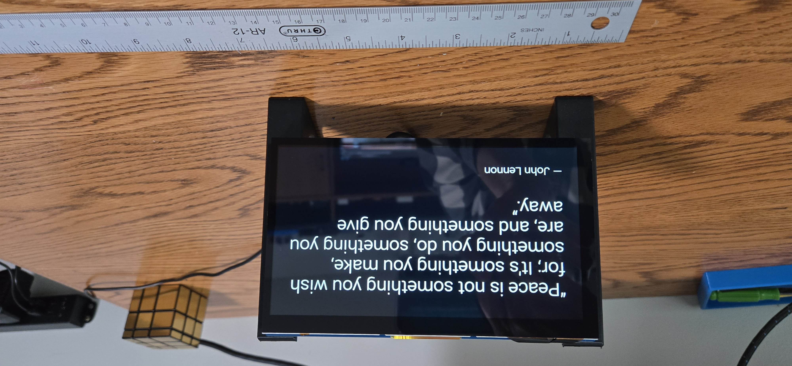
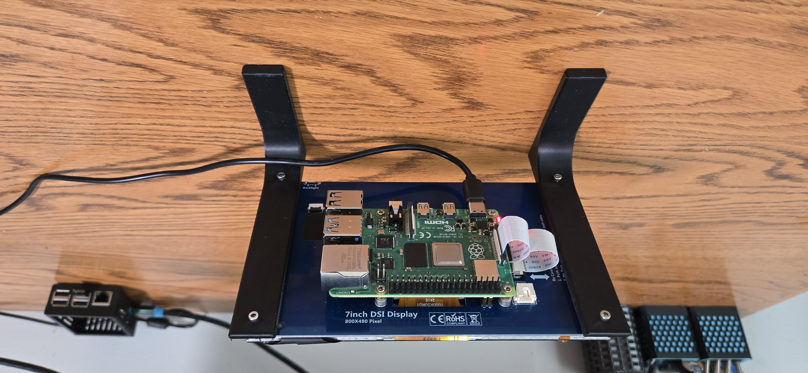

<p float="left">
  
  
</p>


# Wise-Pi HDMI — Setup Guide

A lightweight FastAPI web app that shows a large, readable quote on a Raspberry Pi 4 with a standard HDMI Display, running in **Chromium kiosk mode** at boot. The application will provide a sequence of displays. First it shows a five-day weather forecast, then it displays a random quote, and that is followed by display of an artwork from the Metropolitan Museum of Art (with a Title and Artist line below it). The length of time each content type remains visible is configurable, as well as which of the three content types to include in the rotation.

---

## What you’ll need

- **Raspberry Pi** (RPI 4 or RPI 5 recommended; RPI 3 or RPI Zero 2 W will work but slower)
- *HDMI Display** (such as a PC Monitor)
- **Raspberry Pi OS (Bookworm) 64-bit with Desktop** (Recommended for Pi 4/5)
- Network access (Wi-Fi or Ethernet)

**Repo layout (branch `rpi4-hdmi`):**
app/
main.py
requirements.txt
config.yaml
env.example
static/
index.html
styles.css
systemd/
wise-pi.service 
wise-kiosk.service

---

### 1) OS prep
Update the OS and reboot:
```bash
sudo apt update && sudo apt full-upgrade -y
sudo reboot
```
Install packages:

```bash
sudo apt install -y git python3-venv chromium-browser curl
# Some images use `chromium` instead of `chromium-browser`; we handle both later.
# Optional: hide the mouse in kiosk
sudo apt install -y unclutter
```
---
### 2) Get the code
```bash
cd ~
git clone https://github.com/<stvenmobile>/wise-pi.git
cd wise-pi
git fetch --all --prune
git switch -c rpi4-hdmi origin/rpi4-hdmi
```
### 3) Python venv & dependencies
```bash
cd ~/wise-pi/app
python3 -m venv .venv
. .venv/bin/activate
pip install --upgrade pip
pip install -r requirements.txt
config.yaml — theme/intervals (defaults are fine)

env.example — copy to .env later if you add API keys
```
### 4) Quick manual test (optional)
```bash
cd ~/wise-pi/app
. .venv/bin/activate
python -m uvicorn main:app --host 0.0.0.0 --port 8000
```
On the Pi: open Chromium to http://localhost:8000
From another device: http://<pi-ip>:8000
Stop with Ctrl+C.

### 5) Install and Enable Systemd Services

The service files in the `systemd/` directory are complete but use the placeholder username 'steve'. 
We will copy them to the system location after fixing the username.

**CRITICAL: Use a text editor to globally replace ALL occurrences of 'steve' in the following two files with YOUR actual Raspberry Pi username**

* `~/wise-pi/systemd/wise-pi.service`
* `~/wise-pi/systemd/wise-kiosk.service`

```bash
sudo cp ~/wise-pi/systemd/wise-pi.service /etc/systemd/system/
sudo cp ~/wise-pi/systemd/wise-kiosk.service /etc/systemd/system/

sudo systemctl daemon-reload
sudo systemctl enable wise-pi.service
sudo systemctl enable wise-kiosk.service
sudo systemctl start wise-pi.service
sudo systemctl start wise-kiosk.service
sudo systemctl status wise-pi --no-pager            # status should be active
sudo systemctl status wise-kiosk --no-pager         # status should be active

curl -sS -o /dev/null -w "%{http_code}\n" http://localhost:8000/   # expect 200
```
Tip (local-only): If you don’t want LAN devices to access the API, bind to loopback:
change --host 0.0.0.0 → --host 127.0.0.1 in the unit file and restart the service.


# Instructions for hiding cursor
If you installed unclutter and want to hide the cursor, add this to your session autostart 
(e.g., ~/.config/lxsession/LXDE-pi/autostart):

```bash
@unclutter -idle 1 -root
```
Reboot to confirm kiosk mode.


## Troubleshooting
Kiosk didn’t launch at login

Verify both services are enabled and started successfully
```bash
sudo systemctl status wise-pi
sudo systemctl status wise-kiosk
Confirm Chromium exists (chromium or chromium-browser)
Try manually:

```bash
chromium --kiosk http://localhost:8000    # or chromium-browser
```

API not running

```bash
systemctl status wise-pi --no-pager
journalctl -u wise-pi -n 200 --no-pager
curl -I http://localhost:8000/
```

No quotes / errors on screen

Check connectivity:

```bash
ping -c 2 8.8.8.8
ping -c 2 zenquotes.io
```

## Roadmap ideas
Day/Night themes (light/dark schedule)
Settings page: font size, refresh interval, theme
Offline cache for quotes

## License
MIT (see repository root).

## Credits
FastAPI + Uvicorn for the API
Chromium for kiosk
zenquotes.io for quotes (no key required)

