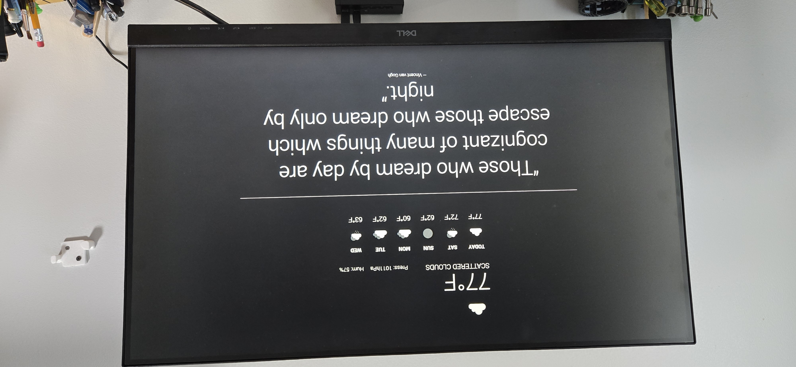
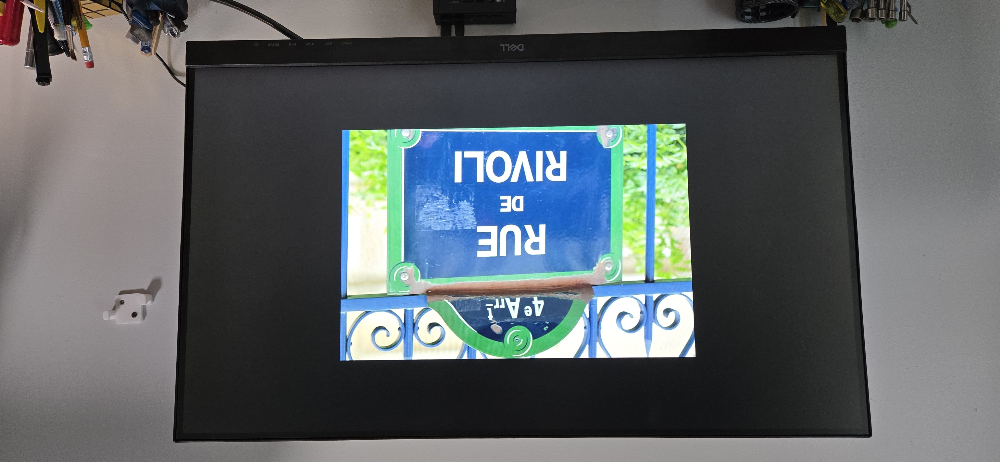

<p float="left">
  
  
</p>


# Wise-Pi HDMI — Setup Guide

A lightweight FastAPI web app hosted on raspberry Pi 4/5 that shows multiple types of content on a standard HDMI Display, 
running in **Chromium kiosk mode** at boot. The application will provide a sequence of displays including any of the follwoing 
content types: Zenquote random quote, Ninjaquote random quote from sel;etable categories, artwork from the Smithsonian 
Institution, artwork from the Harvard Art Museum, or a random photo from user's Flickr account.
The length of time each content type remains visible is configurable, as well as which of the types to include in the rotation, 
and the order in which they are displayed.

---

## What you’ll need

- **Raspberry Pi (RPI 4 or RPI 5)**
- **HDMI Display (PC Monitor, 7" monitor, etc.)**
- **Raspberry Pi OS (Bookworm) 64-bit with Desktop** 
- **Network access (Wi-Fi or Ethernet)**

**Repo layout (branch `rpi4-hdmi`):**
app/
- requirements.txt
- config.yaml
- env.example
- flickr.py
- main.py
- weather.py
- static/
  - index.htm
  - styles.css
autostart/
- unclutter_desktop
- wise-kiosk.desktop
images/
systemd/
- wise-pi.service 


---

### 1) OS prep
Update the OS and reboot:
```bash
sudo apt update && sudo apt full-upgrade -y
sudo reboot
```
Install packages:

```bash
sudo apt install -y git python3-venv chromium-browser curl
# Some images use `chromium` instead of `chromium-browser`; we handle both later.
# Optional: hide the mouse in kiosk
sudo apt install -y unclutter
```
---
### 2) Get the code
```bash
cd ~
git clone https://github.com/stvenmobile/wise-pi.git
cd wise-pi
git fetch --all --prune
git switch -c rpi4-hdmi origin/rpi4-hdmi
```
### 3) Python venv & dependencies
```bash
cd ~/wise-pi/app
python3 -m venv .venv
. .venv/bin/activate
pip install --upgrade pip
pip install -r requirements.txt
```
Review settings in config.yaml, adjust rotation to only include elements you want to include.
Update .env with actual API keys for the content to display

### 4) Quick manual test (optional)
```bash
cd ~/wise-pi/app
. .venv/bin/activate
python -m uvicorn main:app --host 0.0.0.0 --port 8000
```
On the Pi: open Chromium to http://localhost:8000
From another device: http://<pi-ip>:8000
Stop with Ctrl+C.

### 5) Install and Enable Systemd Service

The service file in the `systemd/` directory is complete but edit to replace the placeholder username 'steve'. 
The service file enables the backend python application to run as a service.

**CRITICAL: Use a text editor to globally replace ALL occurrences of 'steve' in the following two files with YOUR actual Raspberry Pi username**


```bash
sudo cp ~/wise-pi/systemd/wise-pi.service /etc/systemd/system/

sudo systemctl daemon-reload
sudo systemctl enable wise-pi.service
sudo systemctl start wise-pi.service
sudo systemctl status wise-pi --no-pager            # status should be active

curl -sS -o /dev/null -w "%{http_code}\n" http://localhost:8000/   # expect 200
```

Tip (local-only): If you don’t want WAN devices to access the API, bind to loopback:
change --host 0.0.0.0 → --host 127.0.0.1 in the unit file and restart the service.


### 6) Configure Autostart to load Chromium in kiosk and unclutter desktop
Use a desktop autostart entry to open Chromium fullscreen to the local app:

```bash
cp ~/wise-pi/autostart/unclutter.desktop ~/.config/autostart/
cp ~/wise-pi/autostart/wisepi-kiosk.desktop ~/.config/autostart/
```

Reboot and access the app URL to confirm kiosk mode.
http://<RPI IP ADDRESS>:8000

## Troubleshooting
Kiosk didn’t launch at login

Verify both services are enabled and started successfully
```bash
sudo systemctl status wise-pi
sudo systemctl status wise-kiosk
```

Try manually:
chromium --kiosk http://localhost:8000    # or chromium-browser

API not running

```bash
systemctl status wise-pi --no-pager
journalctl -u wise-pi -n 200 --no-pager
curl -I http://localhost:8000/
```


## Roadmap ideas
Dark/Light themes 
Add Calendar content
Other content

## License
MIT (see repository root).

## Credits
FastAPI + Uvicorn for the API
Chromium for kiosk
zenquotes.io for quotes (no key required)

