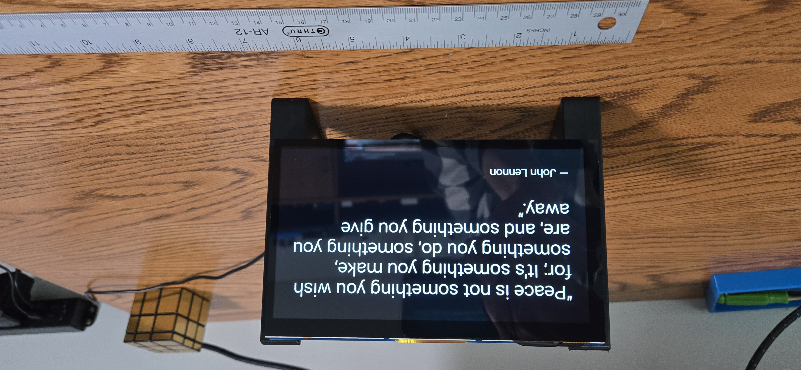
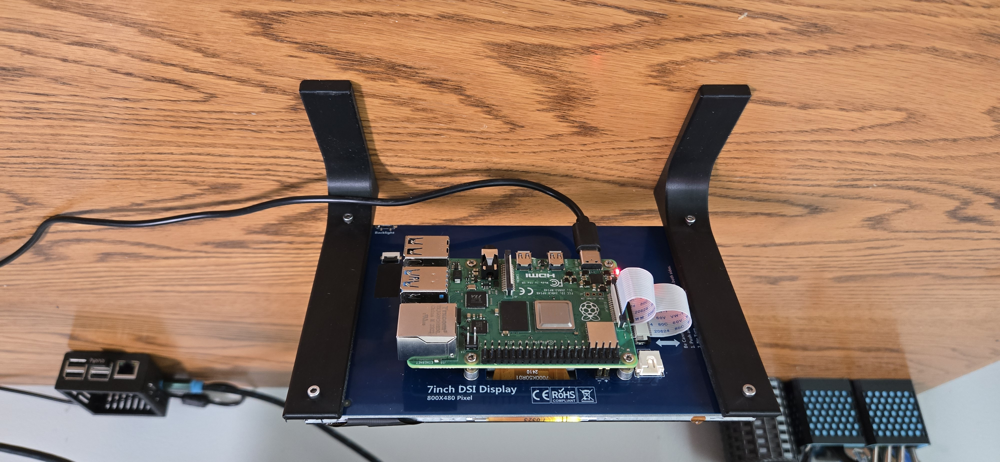

# Wise-Pi Dash (7" DSI) — Setup Guide

A lightweight FastAPI web app that shows a large, readable quote on a Raspberry Pi with a **7" DSI display**, running in **Chromium kiosk mode** at boot. Designed to be simple now (quotes), but flexible for future tiles (weather, headlines, calendar, etc.).

---

## What you’ll need

- **Raspberry Pi 4** (recommended; Zero 2 W will work but is slower)
- **7" DSI display** (official or similar no-name; no touch required)
- **Raspberry Pi OS (Bookworm) with Desktop** (32-bit is fine)
- Network access (Wi-Fi or Ethernet)

**Repo layout (branch `pi-dash-7in`):**
dash/
app/
main.py
requirements.txt
config.yaml
env.example
static/
index.html
styles.css
systemd/
wise-dash.service # example unit: names can differ
wise-kiosk.service # optional user-service example
STL Files/
Brackets.stl # optional desk brackets

yaml
Copy code

---

## 1) OS prep

Update the OS and reboot:
```bash
sudo apt update && sudo apt full-upgrade -y
sudo reboot
Install packages:

bash
Copy code
sudo apt install -y git python3-venv chromium-browser curl
# Some images use `chromium` instead of `chromium-browser`; we handle both later.
# Optional: hide the mouse in kiosk
sudo apt install -y unclutter
2) Get the code
bash
Copy code
cd ~
git clone https://github.com/<YOUR_GH_USER>/wise-pi.git
cd wise-pi
git fetch --all --prune
git switch -c pi-dash-7in origin/pi-dash-7in
3) Python venv & dependencies
bash
Copy code
cd ~/wise-pi/dash/app
python3 -m venv .venv
. .venv/bin/activate
pip install --upgrade pip
pip install -r requirements.txt
config.yaml — theme/intervals (defaults are fine)

env.example — copy to .env later if you add API keys

4) Quick manual test (optional)
bash
Copy code
cd ~/wise-pi/dash/app
. .venv/bin/activate
python -m uvicorn main:app --host 0.0.0.0 --port 8000
On the Pi: open Chromium to http://localhost:8000

From another device: http://<pi-ip>:8000

Stop with Ctrl+C.

5) Install the API as a systemd service
Create and enable a service so the API starts at boot.

bash
Copy code
sudo tee /etc/systemd/system/wise-pi-dash.service >/dev/null <<'EOF'
[Unit]
Description=Wise Pi Dash (FastAPI + Uvicorn)
After=network-online.target
Wants=network-online.target

[Service]
Type=simple
User=%i
WorkingDirectory=/home/%i/wise-pi/dash/app
Environment="PATH=/home/%i/wise-pi/dash/app/.venv/bin"
ExecStart=/home/%i/wise-pi/dash/app/.venv/bin/python -m uvicorn main:app --host 0.0.0.0 --port 8000
Restart=always
RestartSec=3

[Install]
WantedBy=multi-user.target
EOF

# Replace %i with your actual username in the file, then:
sudo systemctl daemon-reload
sudo systemctl enable wise-pi-dash.service
sudo systemctl start  wise-pi-dash.service

# Verify:
systemctl status wise-pi-dash --no-pager
curl -sS -o /dev/null -w "%{http_code}\n" http://localhost:8000/   # expect 200
Tip (local-only): If you don’t want LAN devices to access the API, bind to loopback:
change --host 0.0.0.0 → --host 127.0.0.1 in the unit file and restart the service.

6) Autostart Chromium in kiosk
Use a desktop autostart entry to open Chromium fullscreen to the local app:

bash
Copy code
mkdir -p ~/.config/autostart
cat > ~/.config/autostart/wisepi-kiosk.desktop <<'EOF'
[Desktop Entry]
Type=Application
Name=WisePi Kiosk
Comment=Launch Chromium to the local dash
Exec=/bin/sh -lc 'sleep 5; B=$(command -v chromium || command -v chromium-browser); exec "$B" --noerrdialogs --disable-session-crashed-bubble --disable-infobars --kiosk http://localhost:8000'
X-GNOME-Autostart-enabled=true
EOF
If you installed unclutter and want to hide the cursor, add this to your session autostart (e.g., ~/.config/lxsession/LXDE-pi/autostart):

css
Copy code
@unclutter -idle 1 -root
Reboot to confirm kiosk mode.

7) Rotate the display (optional)
For DSI displays you can rotate via raspi-config:

sudo raspi-config → Display Options → Screen Orientation

Or add to /boot/firmware/config.txt:

ini
Copy code
lcd_rotate=2
Then sudo reboot.

On older images the path may be /boot/config.txt.

8) Update / maintenance
Pull code updates and restart the service if needed:

bash
Copy code
cd ~/wise-pi
git fetch --all --prune
git switch pi-dash-7in
git pull --ff-only

cd ~/wise-pi/dash/app
. .venv/bin/activate
pip install -r requirements.txt
sudo systemctl restart wise-pi-dash
Troubleshooting
Kiosk didn’t launch at login

Ensure file exists: ~/.config/autostart/wisepi-kiosk.desktop

Confirm Chromium exists (chromium or chromium-browser)

Try manually:

bash
Copy code
chromium --kiosk http://localhost:8000    # or chromium-browser ...
API not running

bash
Copy code
systemctl status wise-pi-dash --no-pager
journalctl -u wise-pi-dash -n 200 --no-pager
curl -I http://localhost:8000/
Two displays (HDMI + DSI) weirdness

The window manager may prefer one display. Unplug HDMI during testing or set the primary display in Raspberry Pi Configuration.

No quotes / errors on screen

Check connectivity:

bash
Copy code
ping -c 2 8.8.8.8
ping -c 2 zenquotes.io
3D-printed desk brackets (optional)
File: dash/STL Files/Brackets.stl

Intended for M2.5 screws into the display’s four rear bosses.

Measured hole rectangle: ~92 mm (H) × 154 mm (W), centered. (Verify your panel—these vary.)

Suggested tilt angles: 60° (upright) or 70° (more relaxed). The included STL is a simple stand you can tweak.

Roadmap ideas
Day/Night themes (light/dark schedule)

Weather / Calendar / Headlines tiles

Settings page: font size, refresh interval, theme

Offline cache for quotes

License
MIT (see repository root).

Credits
FastAPI + Uvicorn for the API

Chromium for kiosk

zenquotes.io for quotes (no key required)